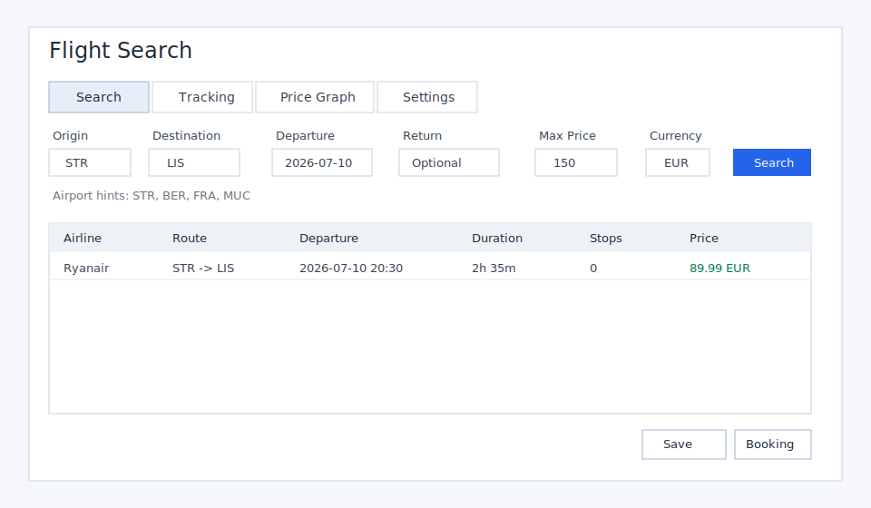

# Flight Search GUI

Python desktop application for searching flights, tracking saved routes, and plotting price history.

Phase 1 uses Tkinter for the first GUI version.

## Setup

```powershell
python -m venv .venv
.\.venv\Scripts\Activate.ps1
pip install -r requirements-app.txt
python main.py
```

Run tests:

```powershell
.\.venv\Scripts\python.exe -m pytest tests
```

## Configuration

Create a local `.env` from `.env.example` and keep it out of Git.

Use mock data without API credentials:

```text
FLIGHT_API_PROVIDER=mock
```

Use Amadeus Self-Service once you have an API key and secret:

```text
FLIGHT_API_PROVIDER=amadeus
AMADEUS_CLIENT_ID=your_client_id
AMADEUS_CLIENT_SECRET=your_client_secret
```

Use Google Flights data through SerpApi:

```text
FLIGHT_API_PROVIDER=serpapi_google_flights
SERPAPI_API_KEY=your_serpapi_key
```

Query every configured structured API provider and merge the results:

```text
FLIGHT_API_PROVIDER=multi_api
```

Open comparison sites for a manual check:

```text
FLIGHT_API_PROVIDER=browser_assisted
```

Open comparison sites, complete any human checks yourself, copy a visible result
block from the browser, and import the clipboard into priced app results:

```text
FLIGHT_API_PROVIDER=semi_manual_site_check
```

The app reads default currency, default origin, database path, provider choice, and Amadeus credentials from environment variables or `.env`.

Provider changes can also be saved from the Settings tab. Restart the app after changing providers so the active search service is rebuilt.

## Features

- Search mock, Amadeus, SerpApi, merged API, browser-assisted, or semi-manual site-check results from the Search tab.
- Save routes for tracking and run manual or interval-based checks.
- Show target-price popups when notifications are enabled.
- Plot saved price history and export route history as CSV.
- Open booking links when a provider supplies one.
- Logs are written locally under `storage/flight_search.log`.

## Screenshot


